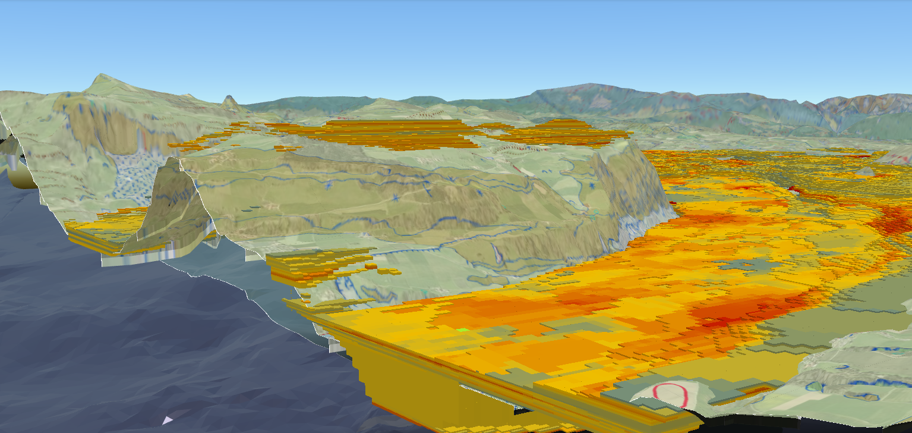

# swissgeol-viewer - 3D sub-surface viewer of Switzerland



## Description

With viewer.swissgeol.ch you can get an overview of available geological data and their location below the earth’s surface. Existing data can be combined or supplemented with your own data.

With the swissgeol viewer you  can ...  
... get an overview of existing data in the sub-surface of Switzerland  
... combine data from above and below ground  
... slice the 3D-scene and get an idea of Switzerland sub-surface  
... add your own data  
... and much more.

## Installation

Follow the steps below to run the 3D sub-surface viewer in your local development environment.

### Prerequisites

- [node.js](https://nodejs.org/en)
- [Rust](https://www.rust-lang.org/)
- [Docker](https://www.docker.com/)

> Note that the development environment is fully dockerized.
> However, we recommend installing every programming language to optimize your experience.

### Set Up the Development Environment
Follow these steps to set up the development environment on your local machine:

#### 1. Install API Dependencies
Navigate to the API directory and download its dependencies:
```bash
cd api && cargo fetch
```

#### 2. Install UI Dependencies
Configure a `GITHUB_TOKEN` as described [here](https://github.com/swisstopo/swissgeol-ui-core/blob/develop/README.md#getting-started)
so you can install the `@swisstopo/swissgeol-ui-core` library.

Afterward, you can install the UI's dependencies:
```bash
cd ui && npm install
```

### Start Development Environment
Start the application's Docker containers:
```bash
docker compose up
```
This will automatically install all dockerized dependencies and also initialize the database.

## Usage
The viewer's API and UI are available as Docker images:

- [`ghcr.io/swisstopo/swissgeol-viewer-api`](https://github.com/swisstopo/swissgeol-viewer-suite/pkgs/container/swissgeol-viewer-api)
- [`ghcr.io/swisstopo/swissgeol-viewer-ui`](https://github.com/swisstopo/swissgeol-viewer-suite/pkgs/container/swissgeol-viewer-ui)

A full deployment for [Kubernetes](https://kubernetes.io/) is available as [Helm](https://helm.sh/) charts in [k8s/](./k8s/).

### URL Parameters

A few URL parameters will modify the behavior of the viewer:

- `noLimit` disable the navigation limits (sphere and lava). Use noLimit=false to enforce limits on local dev.
- `ionAssetIds` display some additional Cesium ION 3dtilesets (coma separated list of CesiumIon ids)
- `ionToken` optional token to access Cesium ION 3dtilesets
- `initialScreenSpaceError` define the visual quality (default: 10000)
- `maximumScreenSpaceError` define the visual quality (default: 2.0 except for localhost which is 20.0)
- `ownterrain=false` disables the terrain (mind that their is only data in the swissrectangle)
  `ownterrain=cli_ticino_0.5m`' use the 0.5m terrain generated using Cesium CLI (for testing only - only around Ticino)
  `ownterrain=cli_walensee_0.5m`' use the 0.5m terrain generated using Cesium CLI (for testing only - only around Walensee)
- `swissrectangle=false` do not restrict rendering to the Swiss rectangle
- `norequestrendermode` disable the resource optimizations (will use 100% CPU)
- `inspector` display the Cesium Inspector widget
- `inspector_wireframe` enable the wireframe mode
- `date` a date to be used for illumination (default to "2018-06-21T10:00:00.000Z")
- `light` a white light source from infinity (ex: 1-2-0-1000 will have direction (1, 2, 0) and intensity 1000)
- `cesiumToolbar` display configuration panel for fog, ambient, background color and terrain underground color


## Support

- [swissgeol@swisstopo.ch](mailto:swissgeol@swisstopo.ch)

## Authors & acknowledgements

- [swisstopo](https://www.swisstopo.admin.ch/de)
- [EBP Schweiz AG](https://www.ebp.global/ch-de)

## License

- [BSD 3-Clause](LICENSE)

## Related projects

- [assets.swissgeol.ch](https://assets.swissgeol.ch)
- [boreholes.swissgeol.ch](https://boreholes.swissgeol.ch)
